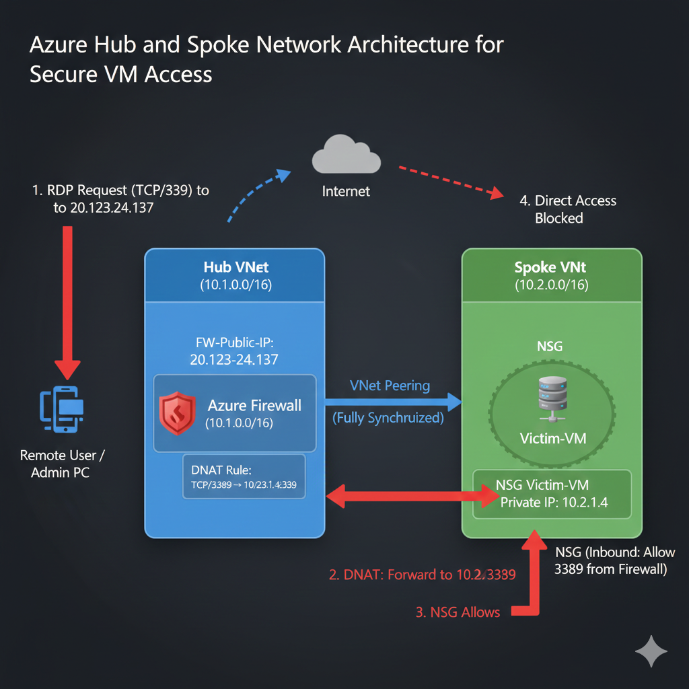
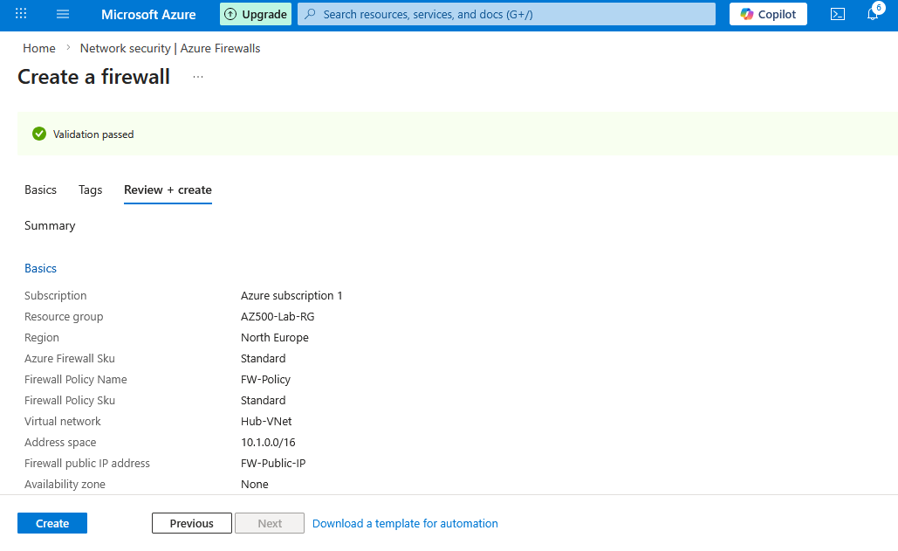
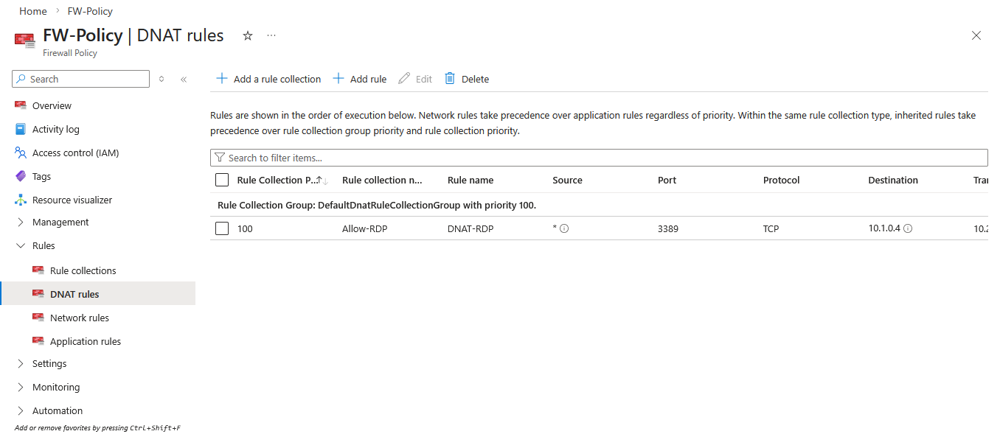
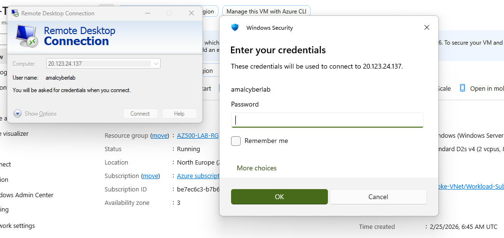

  
  
  

<h1 align="center">🔥 Enterprise Azure Firewall & Hub-Spoke Architecture (AZ-500)</h1>

Production-style Azure Network Security Implementation with DNAT & Private Workload Isolation

---

## 📌 Project Overview

This project demonstrates an **enterprise-grade Hub-and-Spoke network architecture** in Microsoft Azure.

The objective was to:

- Deploy a **private Virtual Machine (Spoke VNet)**
- Centralize security controls in a **Hub VNet**
- Implement **Azure Firewall with DNAT**
- Enable secure RDP access without exposing the VM directly to the internet

This mirrors real-world enterprise network segmentation models.

---

# 🏗️ Architecture Overview

  

### 🔹 Architecture Components

| Component | Purpose |
|-----------|----------|
| **Hub VNet** | Centralized routing & security |
| **Spoke VNet** | Private workload isolation |
| **VNet Peering** | Secure connectivity |
| **Azure Firewall** | Traffic inspection & control |
| **Public IP (Firewall)** | Controlled entry point |
| **Private VM** | No public exposure |
| **DNAT Rule** | PublicIP:3389 → PrivateIP:3389 |

---

# 🔄 Secure Traffic Flow
User → Firewall Public IP (3389)
↓
Azure Firewall DNAT Rule Applied
↓
Traffic forwarded to VM Private IP (10.1.0.x)
↓
NSG validates traffic
↓
Secure RDP Access Established

✔ VM has **no public IP**  
✔ Direct internet access blocked  
✔ All inbound traffic controlled via Firewall  

---

# 🛠️ Implementation Steps

<strong>1️⃣ VNet Peering Configuration</strong>

  

- Hub-to-Spoke bidirectional peering
- Fully synchronized
- Gateway transit configured

---

<strong>2️⃣ Azure Firewall Deployment</strong>

  

- Azure Firewall Standard SKU
- Dedicated subnet (AzureFirewallSubnet)
- Public IP attached
- Firewall Policy created

---

<strong>3️⃣ DNAT Rule Configuration</strong>

  

- Rule Collection: Allow-RDP
- Protocol: TCP
- Port: 3389
- Destination: Firewall Public IP
- Translated to: 10.1.0.x (VM Private IP)

---

<strong>4️⃣ Successful RDP Validation</strong>

  

Secure RDP session established **only via Firewall Public IP**.

---

# 🔐 Security Hardening Implemented

- VM deployed **without Public IP**
- NSG restricted inbound traffic
- Firewall centralized access control
- DNAT used instead of direct exposure
- Segmented network architecture
- Enterprise-style governance model

---

# 🎯 Lessons Learned

- Hub-and-Spoke improves scalability & isolation
- Centralized firewall policies simplify governance
- DNAT enables secure external access
- NSG rule priority troubleshooting is critical
- Azure Firewall acts as controlled gateway

---

# ⚠️ Cost Management

All resources were deleted immediately after validation to avoid unnecessary charges (Azure Firewall incurs hourly cost).

---

# 🎓 Certification Alignment

Aligned with **Microsoft AZ-500 (Azure Security Engineer Associate)**:

- Implement platform protection
- Secure network infrastructure
- Configure network security
- Manage security operations

---

# 📊 Business Value Simulation

This architecture demonstrates:

- Enterprise perimeter security design
- Secure remote administration
- Network segmentation best practices
- Cloud-native firewall implementation

---

# 👨💻 Author

**Amal U. Basnayake**  
Cloud Security | Azure Security Engineer | AZ-500 Focused  

🔗 GitHub: https://github.com/AmalUBasnayake  
🔗 LinkedIn: https://www.linkedin.com/in/amal-udayanga-basnayake-72315b2b9/  
🔗 Medium: https://medium.com/@amalubasnayake  

---

⭐ If this project helped your AZ-500 preparation, consider starring the repository!

